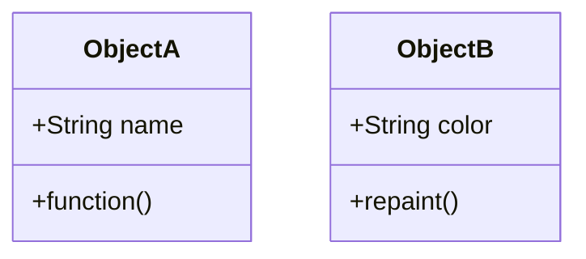

This is an example of an Analog Structure. I'm using the OPC leaves provided for in ClearSCADA and several other OPC servers. 

I'm not totally sure how everyone wants to notate the standard, but I am sure we will figure it out. 

* Base Tag (name using ISA or API standards or your company's internal standard)
  * CurrentValue
  * Units
  * ZeroScale
  * FullScale
  * CurrentTime (may be renamed to LastUpdatedTime
  
# Mermaid Test Diagram

